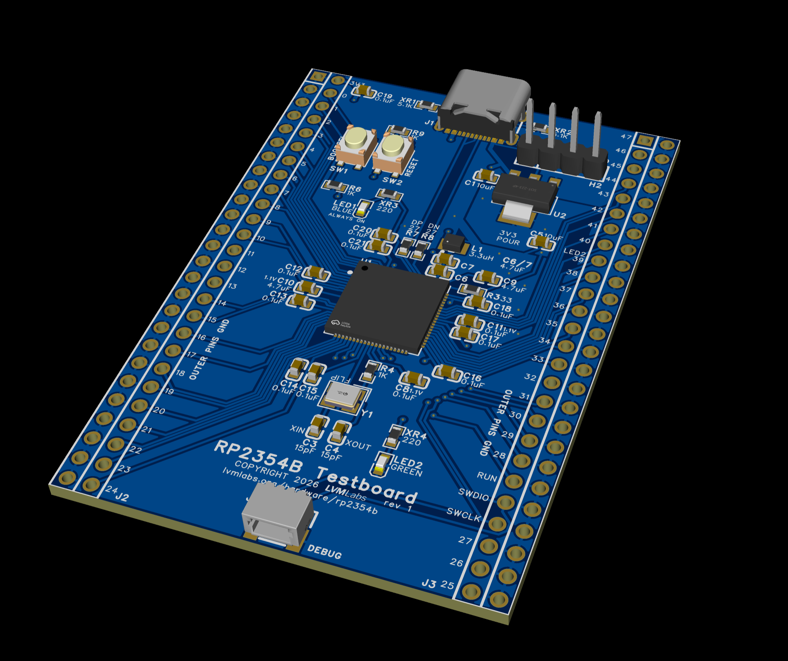
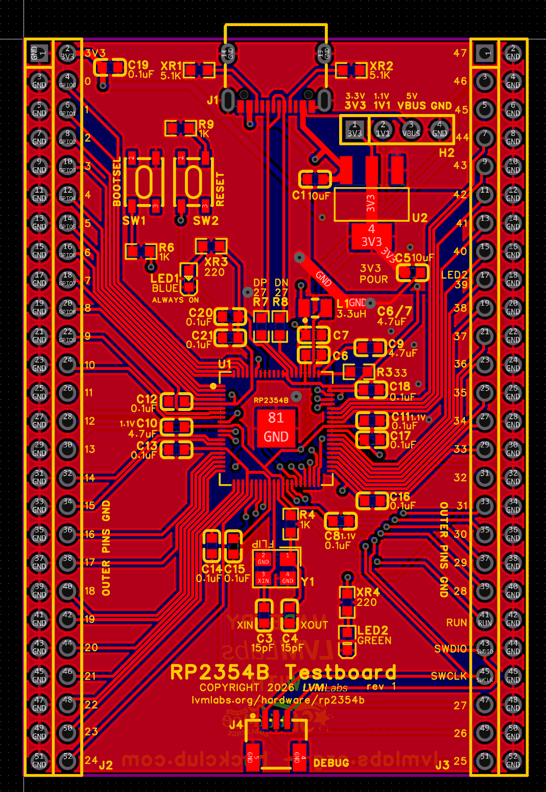
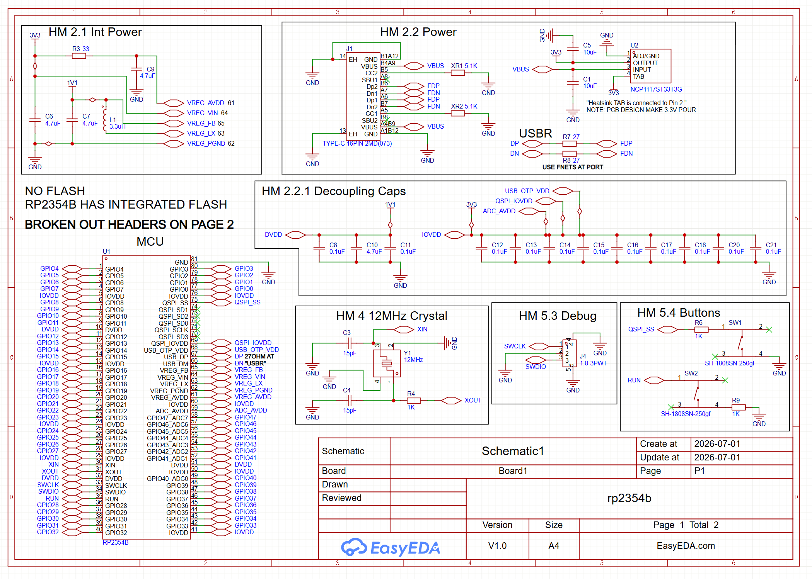
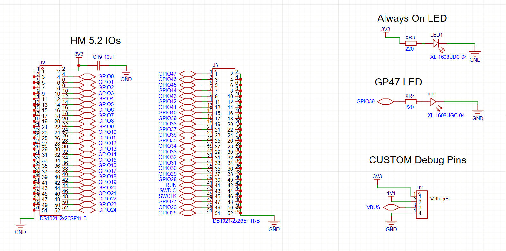

# rp2354b
Board for implementation testing based on the RP2354B MCU from Raspberry Pi.  
Designed by Ryan Kim in LVMLabs (lvmlabs.org), with the support of Hack Club Stardance (stardance.hackclub.com).

### Purpose & Motive
I was looking to implement the RP2354X family of MCUs into my projects, however, I had heard that desigining a board and proper schematic may be difficult. So, I have created this testboard to see if my design works. (and if it does fail, so I don't break a massive project's board)

## Features
* 48 GPIOs, including 8 ADCs
* RP2354B MCU from Raspberry Pi
* On-silicon 2MB flash
* 150MHz dual-core, ARM Cortex-M33 or Hazard3 RISC-V
* One always-on LED, one LED tied to GP29
* USB-C and Debug ports

## PCB
Gerber available at `pcb/RP2354Bv1e1.zip`.  
Default JLC options are fine. If you are assembling by hand, I recommend a Stencil of default JLC options.

## Firmware
Any RP2354B firmware will work on the board.  
Very basic testing micropython scripts are in `fw/`.  
`fw/sweep.py` sweeps from GPIO0 to GPIO47 and pulls each pin HIGH for one second before moving on.  
`fw/ledblink.py` blinks the onboard green LED2.

## Images
`img/pcb-3d-side.png`  

`img/pcb-editor-top.png`  

## Schematic
`img/schematic-page-1.png`  

`img/schematic-page-2.png`  

## BoM
`bom/base.csv` is a simplified BoM without sample shipping or taxes.  
`bom/extended.csv` is the full BoM without sample shipping or taxes.  
`bom/hackclub.csv` is the full BoM with shipping and taxes for use in my Hack Club submission.  
The BoM is also available online on [Google Sheets](https://docs.google.com/spreadsheets/d/1VJ5swNQpICA2gBh6UuN4pqoeGnM9Ii7ZICx3vqN7FYg/edit?usp=sharing).

| ITEM        | VEND   | PRICE  | QTY | TTL    | LINK                                                            |
| ----------- | ------ | ------ | --- | ------ | --------------------------------------------------------------- |
| RP2354B     | LCSC   | 1.5667 | 5   | 7.8335 | [C39843328](https://www.lcsc.com/product-detail/C39843328.html) |
| 4.7uF       | LCSC   | 0.107  | 10  | 1.07   | [C69335](https://www.lcsc.com/product-detail/C69335.html)       |
| 3.3uH       | LCSC   | 0.2828 | 5   | 1.414  | [C42411119](https://www.lcsc.com/product-detail/C42411119.html) |
| 33o         | LCSC   | 0.0022 | 100 | 0.22   | [C108407](https://www.lcsc.com/product-detail/C108407.html)     |
| 5.1Ko       | LCSC   | 0.0029 | 100 | 0.29   | [C2907044](https://www.lcsc.com/product-detail/C2907044.html)   |
| 10uF        | LCSC   | 0.0849 | 20  | 1.698  | [C85713](https://www.lcsc.com/product-detail/C85713.html)       |
| NCP1117     | LCSC   | 0.2356 | 5   | 1.178  | [C26537](https://www.lcsc.com/product-detail/C26537.html)       |
| USBC16      | LCSC   | 0.0744 | 20  | 1.488  | [C2765186](https://www.lcsc.com/product-detail/C2765186.html)   |
| 0.1uF       | LCSC   | 0.0213 | 100 | 2.13   | [C1591](https://www.lcsc.com/product-detail/C1591.html)         |
| 12MHz C     | LCSC   | 0.2945 | 5   | 1.4725 | [C20625731](https://www.lcsc.com/product-detail/C20625731.html) |
| 1K          | LCSC   | 0.0057 | 100 | 0.57   | [C2907002](https://www.lcsc.com/product-detail/C2907002.html)   |
| 15pF        | LCSC   | 0.0057 | 100 | 0.57   | [C107037](https://www.lcsc.com/product-detail/C107037.html)     |
| 27          | LCSC   | 0.0036 | 100 | 0.36   | [C25190](https://www.lcsc.com/product-detail/C25190.html)       |
| 3pin JST    | LCSC   | 0.045  | 10  | 0.45   | [C2763613](https://www.lcsc.com/product-detail/C2763613.html)   |
| Pushbutton  | LCSC   | 0.0312 | 20  | 0.624  | [C52092028](https://www.lcsc.com/product-detail/C52092028.html) |
| 2x26 Header | LCSC   | 0.2599 | 10  | 2.599  | [C7430422](https://www.lcsc.com/product-detail/C7430422.html)   |
| 1x4 Header  | LCSC   | 0.0283 | 20  | 0.566  | [C52016392](https://www.lcsc.com/product-detail/C52016392.html) |
| BLUE LED    | LCSC   | 0.0043 | 100 | 0.43   | [C965807](https://www.lcsc.com/product-detail/C965807.html)     |
| GREEN LED   | LCSC   | 0.005  | 100 | 0.5    | [C965804](https://www.lcsc.com/product-detail/C965804.html)     |
| 220o        | LCSC   | 0.0025 | 100 | 0.25   | [C2907127](https://www.lcsc.com/product-detail/C2907127.html)   |
| PCB         | JLCPCB | 2      | 1   | 2      | [jlcpcb.com](http://jlcpcb.com/)                                |
| Stencil     | JLCPCB | 3.07   | 1   | 3.07   | [jlcpcb.com](http://jlcpcb.com/)                                |

### Shipping - Case-by-case
| ITEM        | VEND   | PRICE  | QTY | TTL    | LINK                                                            |
| ----------- | ------ | ------ | --- | ------ | --------------------------------------------------------------- |
| GDSL    | JLCPCB | 10.86  | 1   | 10.86  | [jlcpcb.com](http://jlcpcb.com/)                                    |
| GDSL    | LCSC   | 12.84  | 1   | 12.84  | [lcsc.com](http://lcsc.com/)                                        |

### Total - Case-by-case
Subtotal - 54.483  
SCCo 10% Sales Tax - 5.4483  
Total - 59.9313 - **$59.94**  
Approx. $60